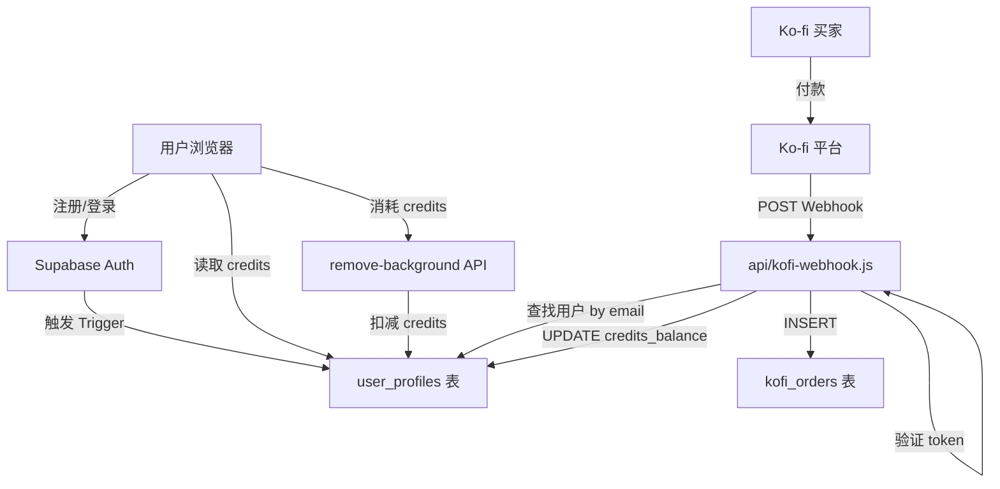
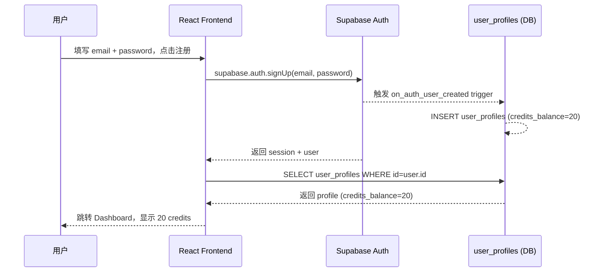
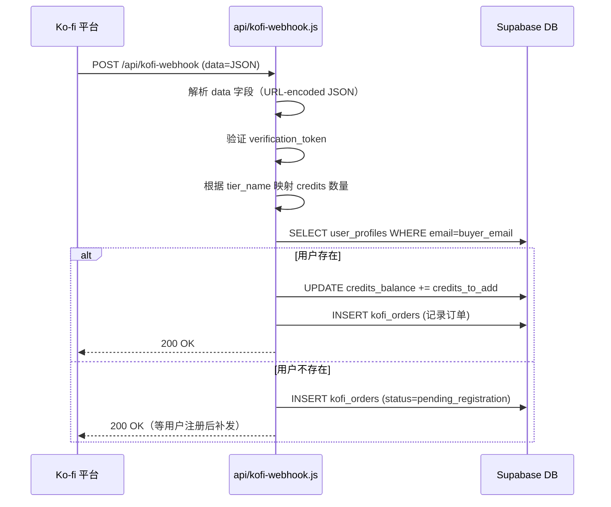

# Design Document: Supabase Auth + Credits & Ko-fi Webhook

## Overview

本功能将 AmazonReady AI 从 demo 模式（localStorage credits）迁移到真实的 Supabase 认证体系，并通过 Ko-fi Webhook 实现付款后自动发放 credits，无需人工干预。

涉及两个子功能：
1. **Supabase 认证 + Credits 数据库化**：用户注册/登录使用 Supabase Auth，credits 余额存储在 `user_profiles` 表，替换现有 localStorage 方案。
2. **Ko-fi Webhook 自动发 Credits**：Ko-fi 付款成功后调用 Vercel Serverless Function，根据购买套餐自动给对应用户账号增加 credits。

---

## Architecture




## Sequence Diagrams

### 用户注册流程



### Ko-fi Webhook 自动发 Credits 流程



---

## Components and Interfaces

### Component 1: authStore (Zustand)

**Purpose**: 管理用户认证状态和 credits，替换 localStorage 方案

**Interface**:
```typescript
interface AuthState {
  user: User | null
  profile: UserProfile | null
  loading: boolean
  initialized: boolean
  signUp: (email: string, password: string) => Promise<AuthResult>
  signIn: (email: string, password: string) => Promise<AuthResult>
  signOut: () => Promise<void>
  fetchProfile: () => Promise<void>
  deductCredit: () => Promise<boolean>        // 消耗 1 credit，返回是否成功
  initialize: () => Promise<void>
}

interface UserProfile {
  id: string
  email: string
  subscription_tier: 'free' | 'starter' | 'pro' | 'enterprise'
  credits_balance: number
  credits_used: number
}

type AuthResult = { success: boolean; error?: string }
```

**Responsibilities**:
- 初始化时从 Supabase 恢复 session
- 监听 `onAuthStateChange` 保持状态同步
- `deductCredit()` 直接操作 Supabase，不再走 localStorage
- 移除 demo 模式分支逻辑

### Component 2: CreditBalance

**Purpose**: 从 authStore 读取 credits，替换 storageService 轮询

**Interface**:
```typescript
// 改为订阅 authStore，无需 setInterval 轮询
const { profile } = useAuthStore()
const credits = profile?.credits_balance ?? 0
```

### Component 3: api/kofi-webhook.js

**Purpose**: 接收 Ko-fi Webhook，验证并自动发放 credits

**Interface**:
```typescript
// POST /api/kofi-webhook
// Body: application/x-www-form-urlencoded
// data=<URL-encoded JSON string>

interface KofiPayload {
  verification_token: string
  type: 'Shop Order' | 'Donation' | 'Subscription'
  kofi_transaction_id: string
  email: string                  // 买家邮箱
  tier_name: string | null       // 套餐名称
  amount: string                 // 金额字符串，如 "19.00"
  currency: string
  is_first_subscription_payment: boolean
  timestamp: string
}
```

**Responsibilities**:
- 验证 `verification_token` 防止伪造请求
- 解析 Ko-fi data 字段（URL-encoded JSON）
- 根据 `tier_name` 或 `amount` 映射 credits 数量
- 用 Supabase Service Role Key 操作数据库（绕过 RLS）
- 幂等处理：通过 `kofi_transaction_id` 防止重复发放


---

## Data Models

### user_profiles 表（已有，需补充字段）

```sql
-- 现有表结构已满足需求，无需新增字段
-- credits_balance INTEGER DEFAULT 20  ✅
-- credits_used INTEGER DEFAULT 0      ✅
-- subscription_tier TEXT              ✅
-- email TEXT                          ✅

-- 需要确认的 RLS Policy：
-- Service Role 可以 UPDATE（webhook 使用）
-- 用户只能读写自己的行（已有）
```

### kofi_orders 表（新增）

```sql
CREATE TABLE IF NOT EXISTS public.kofi_orders (
  id UUID PRIMARY KEY DEFAULT gen_random_uuid(),
  kofi_transaction_id TEXT UNIQUE NOT NULL,   -- 幂等键
  buyer_email TEXT NOT NULL,
  tier_name TEXT,
  amount DECIMAL(10, 2),
  currency TEXT DEFAULT 'USD',
  credits_granted INTEGER NOT NULL,
  user_id UUID REFERENCES auth.users(id),     -- 可为 NULL（用户未注册时）
  status TEXT DEFAULT 'completed'
    CHECK (status IN ('completed', 'pending_registration', 'duplicate')),
  raw_payload JSONB,                          -- 存原始 webhook 数据
  created_at TIMESTAMPTZ DEFAULT NOW()
);

CREATE INDEX idx_kofi_orders_email ON public.kofi_orders(buyer_email);
CREATE INDEX idx_kofi_orders_transaction ON public.kofi_orders(kofi_transaction_id);

-- RLS: 只允许 service role 写入，用户可查看自己的订单
ALTER TABLE public.kofi_orders ENABLE ROW LEVEL SECURITY;

CREATE POLICY "Users can view own orders"
  ON public.kofi_orders FOR SELECT
  USING (auth.uid() = user_id);
```

### Credits 套餐映射

```typescript
const KOFI_CREDITS_MAP: Record<string, number> = {
  'Starter':    500,
  'Pro':        2000,
  'Enterprise': -1,   // -1 表示 unlimited（credits_balance 设为 999999）
}

// 按金额兜底映射（tier_name 为空时）
const AMOUNT_CREDITS_MAP: Record<string, number> = {
  '19': 500,
  '49': 2000,
  '199': 999999,
}
```

---

## Key Functions with Formal Specifications

### Function 1: deductCredit()

```typescript
async function deductCredit(): Promise<boolean>
```

**Preconditions:**
- `user` 不为 null（已登录）
- `profile.credits_balance >= 1`

**Postconditions:**
- 返回 `true` 时：数据库 `credits_balance -= 1`，`credits_used += 1`
- 返回 `false` 时：数据库无变化（余额不足或未登录）
- 操作完成后调用 `fetchProfile()` 刷新本地状态

**Loop Invariants:** N/A

### Function 2: handleKofiWebhook()

```typescript
async function handleKofiWebhook(req, res): Promise<void>
```

**Preconditions:**
- `req.method === 'POST'`
- `req.body.data` 为合法 URL-encoded JSON 字符串
- `payload.verification_token === process.env.KOFI_VERIFICATION_TOKEN`

**Postconditions:**
- 若 `kofi_transaction_id` 已存在：返回 200，不重复发放（幂等）
- 若用户存在：`user_profiles.credits_balance += credits_to_add`，`kofi_orders` 新增记录
- 若用户不存在：`kofi_orders` 新增记录（`status='pending_registration'`），等用户注册后补发
- 始终返回 HTTP 200（Ko-fi 要求，否则会重试）

**Loop Invariants:** N/A

### Function 3: grantPendingCredits()

```typescript
async function grantPendingCredits(userId: string, email: string): Promise<void>
```

**Purpose**: 用户注册时，检查是否有 pending 订单，有则补发 credits

**Preconditions:**
- 用户刚完成注册，`userId` 有效

**Postconditions:**
- 所有 `status='pending_registration'` 且 `buyer_email=email` 的订单被处理
- `user_profiles.credits_balance` 累加所有 pending credits
- 对应订单 `status` 更新为 `'completed'`，`user_id` 填入


---

## Algorithmic Pseudocode

### 主流程：Webhook 处理算法

```pascal
PROCEDURE handleKofiWebhook(req, res)
  INPUT: HTTP POST request
  OUTPUT: HTTP 200 response (always)

  SEQUENCE
    // Step 1: 解析 payload
    rawData ← req.body.data
    payload ← JSON.parse(decodeURIComponent(rawData))

    // Step 2: 验证 token
    IF payload.verification_token ≠ KOFI_VERIFICATION_TOKEN THEN
      RETURN res.status(200).json({ error: 'Invalid token' })
    END IF

    // Step 3: 幂等检查
    existing ← SELECT FROM kofi_orders WHERE kofi_transaction_id = payload.kofi_transaction_id
    IF existing EXISTS THEN
      RETURN res.status(200).json({ status: 'duplicate' })
    END IF

    // Step 4: 映射 credits
    creditsToAdd ← mapCredits(payload.tier_name, payload.amount)
    IF creditsToAdd = 0 THEN
      RETURN res.status(200).json({ status: 'unknown_tier' })
    END IF

    // Step 5: 查找用户
    userProfile ← SELECT FROM user_profiles WHERE email = payload.email

    IF userProfile EXISTS THEN
      // Step 6a: 直接发放
      UPDATE user_profiles
        SET credits_balance = credits_balance + creditsToAdd,
            subscription_tier = mapTier(payload.tier_name)
        WHERE email = payload.email

      INSERT INTO kofi_orders (
        kofi_transaction_id, buyer_email, tier_name,
        amount, credits_granted, user_id, status, raw_payload
      ) VALUES (
        payload.kofi_transaction_id, payload.email, payload.tier_name,
        payload.amount, creditsToAdd, userProfile.id, 'completed', payload
      )
    ELSE
      // Step 6b: 用户未注册，记录 pending
      INSERT INTO kofi_orders (
        kofi_transaction_id, buyer_email, tier_name,
        amount, credits_granted, status, raw_payload
      ) VALUES (
        payload.kofi_transaction_id, payload.email, payload.tier_name,
        payload.amount, creditsToAdd, 'pending_registration', payload
      )
    END IF

    RETURN res.status(200).json({ status: 'ok' })
  END SEQUENCE
END PROCEDURE
```

### 注册时补发 pending credits 算法

```pascal
PROCEDURE grantPendingCredits(userId, email)
  INPUT: userId (UUID), email (String)
  OUTPUT: void

  SEQUENCE
    pendingOrders ← SELECT FROM kofi_orders
      WHERE buyer_email = email AND status = 'pending_registration'

    IF pendingOrders IS EMPTY THEN
      RETURN
    END IF

    totalCredits ← 0
    FOR each order IN pendingOrders DO
      totalCredits ← totalCredits + order.credits_granted
    END FOR

    UPDATE user_profiles
      SET credits_balance = credits_balance + totalCredits
      WHERE id = userId

    UPDATE kofi_orders
      SET status = 'completed', user_id = userId
      WHERE buyer_email = email AND status = 'pending_registration'
  END SEQUENCE
END PROCEDURE
```

### Credits 扣减算法

```pascal
PROCEDURE deductCredit(userId)
  INPUT: userId (UUID)
  OUTPUT: success (Boolean)

  SEQUENCE
    profile ← SELECT credits_balance FROM user_profiles WHERE id = userId

    IF profile.credits_balance < 1 THEN
      RETURN false
    END IF

    // Enterprise 用户（credits_balance = 999999）不实际扣减
    IF profile.credits_balance = 999999 THEN
      UPDATE user_profiles SET credits_used = credits_used + 1 WHERE id = userId
      RETURN true
    END IF

    UPDATE user_profiles
      SET credits_balance = credits_balance - 1,
          credits_used = credits_used + 1
      WHERE id = userId AND credits_balance >= 1

    RETURN (affected_rows = 1)
  END SEQUENCE
END PROCEDURE
```

---

## Error Handling

### Error Scenario 1: Supabase 未配置（环境变量缺失）

**Condition**: `VITE_SUPABASE_URL` 或 `VITE_SUPABASE_ANON_KEY` 为空
**Response**: 显示配置错误提示，不进入 demo 模式（移除 demo 分支）
**Recovery**: 用户需配置正确的环境变量

### Error Scenario 2: Ko-fi Webhook token 验证失败

**Condition**: `payload.verification_token` 与环境变量不匹配
**Response**: 返回 HTTP 200（避免 Ko-fi 重试），记录警告日志
**Recovery**: 检查 `KOFI_VERIFICATION_TOKEN` 环境变量配置

### Error Scenario 3: 用户购买时未注册账号

**Condition**: `kofi_orders` 查不到对应 email 的 `user_profiles`
**Response**: 订单以 `pending_registration` 状态存入数据库
**Recovery**: 用户注册时触发 `grantPendingCredits()`，自动补发

### Error Scenario 4: Credits 不足时尝试处理图片

**Condition**: `profile.credits_balance < 1`
**Response**: 前端显示 toast 提示"Credits 不足，请购买套餐"，阻止 API 调用
**Recovery**: 用户购买套餐后自动恢复

### Error Scenario 5: Webhook 重复投递

**Condition**: 同一 `kofi_transaction_id` 再次到达
**Response**: 查到已存在记录，直接返回 200，不重复发放
**Recovery**: 无需恢复，幂等设计

---

## Testing Strategy

### Unit Testing Approach

- `mapCredits(tier_name, amount)` 纯函数：覆盖所有套餐名称和金额兜底
- `grantPendingCredits()` 逻辑：mock Supabase client，验证 SQL 调用参数
- `deductCredit()` 边界：余额为 0、余额为 1、Enterprise 用户

### Property-Based Testing Approach

**Property Test Library**: fast-check

- 任意合法 Ko-fi payload → webhook 始终返回 HTTP 200
- 任意重复 `kofi_transaction_id` → credits 只发放一次
- 任意用户注册 → pending credits 总量等于所有 pending 订单之和

### Integration Testing Approach

- 使用 Supabase 本地开发环境（`supabase start`）
- 模拟完整注册 → 购买 → credits 到账流程
- 验证 RLS Policy：用户只能读自己的 profile 和 orders

---

## Security Considerations

- **Webhook 验证**: `KOFI_VERIFICATION_TOKEN` 存 Vercel 环境变量，不暴露到前端
- **Service Role Key**: `SUPABASE_SERVICE_ROLE_KEY` 仅在 Vercel Serverless Function 使用，绝不放入前端代码
- **RLS Policy**: `user_profiles` 和 `kofi_orders` 均启用 Row Level Security
- **Credits 扣减**: 在数据库层用 `AND credits_balance >= 1` 条件防止并发超扣
- **CORS**: webhook endpoint 不需要 CORS（Ko-fi 服务端调用）

---

## Dependencies

| 依赖 | 用途 | 已有 |
|------|------|------|
| `@supabase/supabase-js` | Supabase 客户端 | ✅ |
| Supabase Auth | 用户注册/登录 | ✅（需配置） |
| Supabase Database | user_profiles, kofi_orders | ✅（需运行迁移） |
| Vercel Serverless Functions | Ko-fi webhook handler | ✅ |
| `KOFI_VERIFICATION_TOKEN` | Webhook 安全验证 | ❌ 需新增环境变量 |
| `SUPABASE_SERVICE_ROLE_KEY` | Webhook 绕过 RLS 操作 DB | ❌ 需新增环境变量 |
| `VITE_SUPABASE_URL` | 前端 Supabase 连接 | ❌ 需配置 |
| `VITE_SUPABASE_ANON_KEY` | 前端 Supabase 连接 | ❌ 需配置 |

---

## Environment Variables Checklist

```bash
# Vercel 环境变量（Production + Preview）
VITE_SUPABASE_URL=https://xxxx.supabase.co
VITE_SUPABASE_ANON_KEY=eyJ...
SUPABASE_SERVICE_ROLE_KEY=eyJ...   # 仅后端使用，绝不暴露前端
KOFI_VERIFICATION_TOKEN=xxxx       # 从 Ko-fi 后台 Webhooks 页面获取
REMOVE_BG_API_KEY=3nkRvTGhP3HdEihD8TWDKR6M  # 已配置 ✅
```
